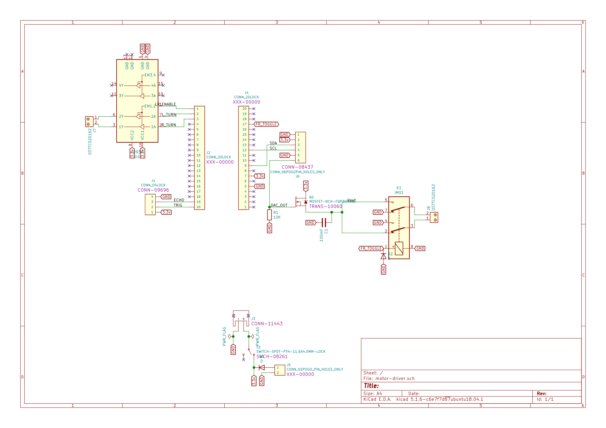

### Autonomous Car for Arduino

### About
This project uses an Arduino UNO to control a repurposed remote control car.
An ultrasonic sensor (HC-SR04) detects distance from objects.
A digital to analog converter (MCP4725) controls the motors speed.
A relay switch controls the forward and reverse direction.
A motor driver chip (LR293D) controls left and right turning.

Developed using Platform IO and KiCad.
